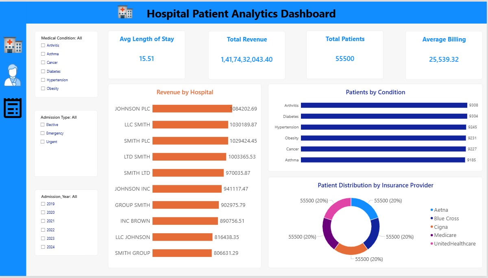
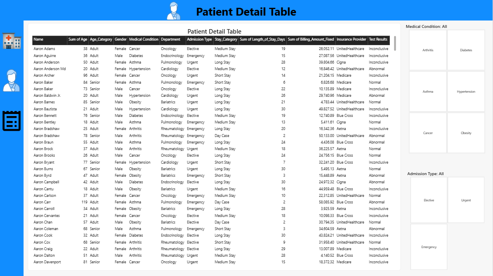
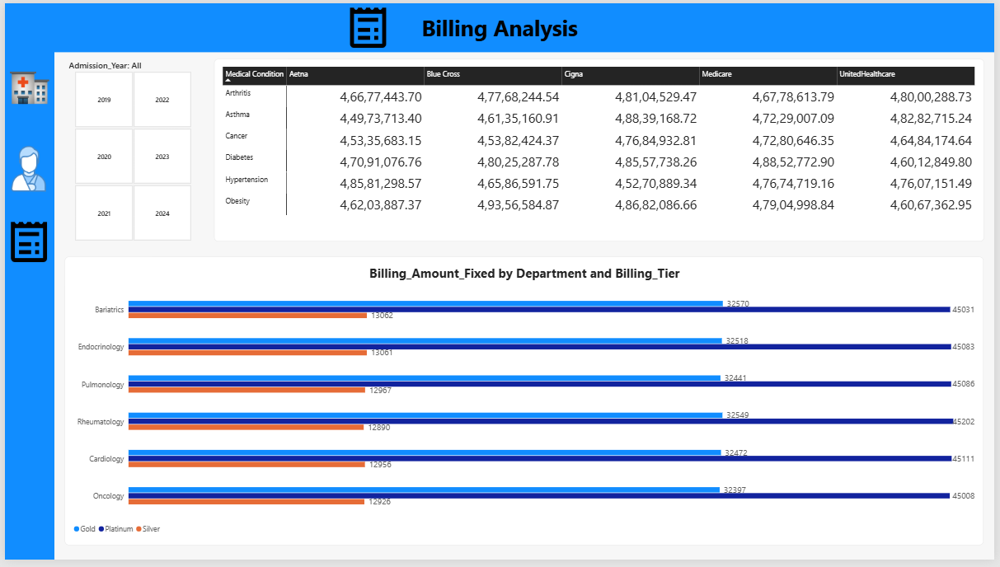
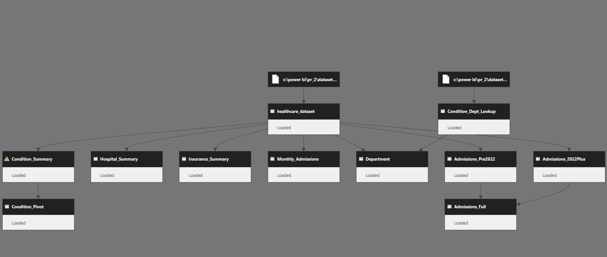

# 🏥 Hospital Patient Analytics Dashboard

<div align="center">

# 📊 Healthcare Analytics & Billing Intelligence Dashboard

### Transforming Raw Healthcare Data into Actionable Insights



</div>

---

## 🌟 Project Overview

This project is a **Power BI Healthcare Analytics Dashboard** designed to provide comprehensive insights into patient admissions, hospital performance, billing trends, insurance distribution, and medical conditions.

The solution enables healthcare stakeholders to:

✅ Monitor patient volume and hospital utilization  
✅ Analyze revenue and billing performance  
✅ Track medical conditions and admission patterns  
✅ Evaluate insurance provider distributions  
✅ Explore detailed patient-level records  
✅ Support data-driven healthcare decision-making  

---

## 📸 Dashboard Screenshots

### 🏠 Executive Overview Dashboard

![Executive Dashboard] ss_1.PNG

Provides high-level KPIs including:

- Average Length of Stay
- Total Revenue
- Total Patients
- Average Billing Amount
- Revenue by Hospital
- Patients by Medical Condition
- Insurance Provider Distribution

---

### 👨‍⚕️ Patient Detail Analysis



Detailed patient-level reporting featuring:

- Patient demographics
- Admission details
- Medical conditions
- Departments
- Insurance providers
- Billing amounts
- Test results

---

### 💰 Billing Analysis Dashboard



Key billing insights:

- Billing by Insurance Provider
- Department-wise Billing Analysis
- Billing Tier Comparisons
- Multi-year Financial Trends

---

### 🗂️ Data Model Architecture



The data model follows a structured approach using:

- Fact Tables
- Summary Tables
- Lookup Tables
- Optimized Relationships
- Performance-Oriented Design

---

## 📈 Key Metrics

| Metric | Description |
|----------|------------|
| 👥 Total Patients | Total number of patients in the dataset |
| 💵 Total Revenue | Overall healthcare revenue generated |
| 🏥 Average Billing | Average billing amount per patient |
| ⏳ Avg Length of Stay | Average hospitalization duration |
| 📋 Admission Types | Elective, Emergency, Urgent |
| 🩺 Medical Conditions | Disease-specific analysis |

---

## 🧩 Features

### 📊 Executive Dashboard
- KPI Monitoring
- Revenue Analysis
- Condition Analysis
- Insurance Distribution

### 👤 Patient Analytics
- Patient Records
- Age Category Analysis
- Admission Tracking
- Test Result Monitoring

### 💰 Financial Analytics
- Billing Trends
- Insurance Comparison
- Department Performance
- Billing Tier Evaluation

### 🔍 Interactive Filtering
- Medical Condition Filters
- Admission Type Filters
- Year Filters
- Cross Dashboard Interaction

---

## 🏗️ Tech Stack

| Tool | Purpose |
|--------|---------|
| ⚡ Power BI | Dashboard Development |
| 📄 CSV Dataset | Data Source |
| 🧮 DAX | Measures & Calculations |
| 🔄 Power Query | Data Transformation |
| 📊 Data Modeling | Relationship Management |

---

## 📂 Repository Structure

```text
📦 Hospital-Patient-Analytics
│
├── 📊 Health_care_dashboard.pbix
├── 📄 healthcare_dataset.csv
├── 📄 Condition_Dept_Lookup.csv
├── 🖼️ ss_1.png
├── 🖼️ ss_2.png
├── 🖼️ ss_3.png
├── 🖼️ ss_4.png
└── 📘 README.md
```

---

## 🚀 Getting Started

1. Clone the repository
2. Open `Health_care_dashboard.pbix`
3. Refresh data connections if required
4. Explore the interactive dashboards

```bash
git clone https://github.com/your-username/hospital-patient-analytics.git
```

---

## 🎯 Business Value

This dashboard helps healthcare organizations:

- Improve operational visibility
- Optimize resource allocation
- Monitor financial performance
- Identify patient care trends
- Enhance strategic decision-making

---

## 👨‍💻 Author


## Meet Mehta

📊 Aspiring Data Analyst
💻 Power BI • Excel • SQL • Python
🚀 Passionate about transforming data into insights


---

<div align="center">

### ⭐ If you found this project useful, consider giving it a star! ⭐

</div>
